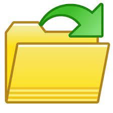
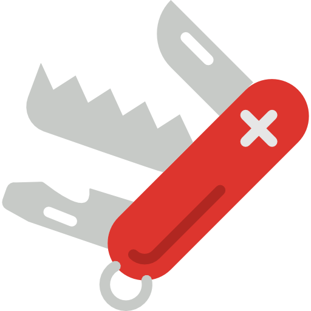
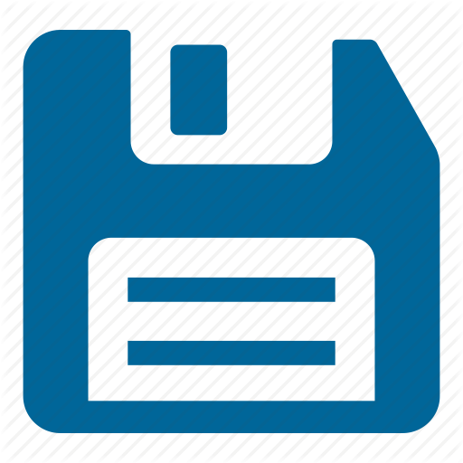
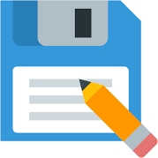

# Microstate Template Editor and Explorer

## Installation

1) Download the two files MSTemplateEditor.mlapp and MSTemplateExplorer.mlapp
2) In MATLAB, select the APPS tab, hit the Install App button, and select the two downloaded files
3) The Apps should now be available in the Apps toolbar of MATLAB
  
## Using the Microstate Template Editor

The Microstate Template Editor lets you import new sets of microstate template maps, check if the import completed correctly, and add findings associated with particular microstate class. It also collects data about the publication where these findings came out, and some extra-information like the number of subject and other parameters of the data and analysis. 

### Loading templates:
- If you have conducted the microstate analysis using our EEGLAB toolbox (available here: https://github.com/ThomasKoenigBern/microstates), you can directly import your grandmean(s) into the editor by using the  button. Note that you can only edit the template with a single number of classes. If your data contains more than one set, you will be asked to make choice during the import.
- For data created in CarTool, you should be able to use the  button. Note that you also need the corresponding xyz file.
- For other data, you can read in the maps as map x electrode text file, and provide a list of electrode labels of the 10-20 system for the elecrode coordinates (use the  button). 
- Other import options may be implemented upon reasonable request.

Once you have been able to import your templates, make sure they look as you expect it. 

### Editing templates
When editing your templates, you should do all of the following
1) Adjust, if necessary, the order of the templates to correspond to the order used in the publication,
2) Label the template maps according to the publication
3) Add, Edit, or Remove empirical findings. Please make sure you present them in a maximally concise and precise form.
4) Add all the information about the publication
5) Add the meta-information, such as number of subjects, filter-settings, software used, etc.

### Saving templates
Once our done editing, you can save the data using the Save  and SaveAs  buttons.

### Submitting your edited template to the database
Ideally, you send the resulting data to thomas.koenig(at)unibe.ch who will check it and add it to the database. Note however that, we only accept template sets that have been published. Please provide overall grandmean templates unless there is statistically supported evidence for topographic differences between relevant mean template sets
